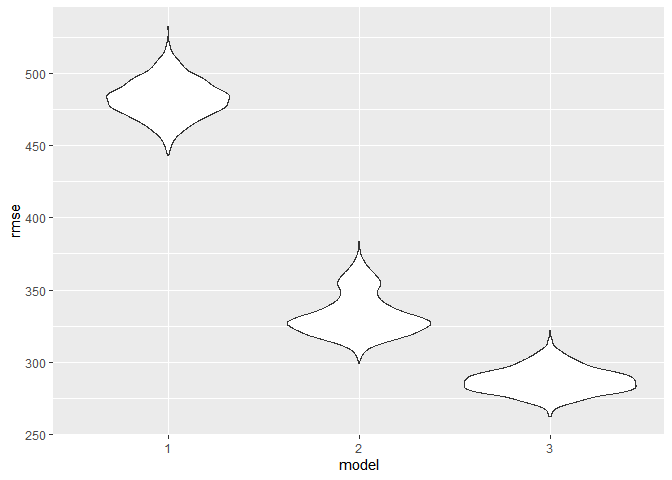

Homework 6
================
Na Yun Cho

``` r
library(tidyverse)
```

    ## -- Attaching packages ------------------------------------------------------------- tidyverse 1.3.0 --

    ## v ggplot2 3.3.2     v purrr   0.3.4
    ## v tibble  3.0.3     v dplyr   1.0.2
    ## v tidyr   1.1.2     v stringr 1.4.0
    ## v readr   1.3.1     v forcats 0.5.0

    ## -- Conflicts ---------------------------------------------------------------- tidyverse_conflicts() --
    ## x dplyr::filter() masks stats::filter()
    ## x dplyr::lag()    masks stats::lag()

``` r
library(modelr)
```

# Problem 2

### load data, propose a regression model

``` r
birthweight = read.csv("./data/Birthweight.csv") %>%
  mutate(babysex = as.factor(babysex),
         frace = as.factor(frace),
         malform = as.factor(malform),
         mrace = as.factor(mrace)) %>%
  drop_na()

model_1 = lm(bwt ~ delwt + ppbmi, data = birthweight)

birthweight %>% 
add_residuals(model_1) %>%
ggplot(aes(x = resid)) +
geom_density() +
labs(x = "residuals", title = "density plot of model residuals")
```

<!-- -->

``` r
birthweight %>%
add_residuals(model_1) %>%
add_predictions(model_1) %>%
ggplot(aes(x = resid, y = pred)) +
geom_point() +
labs(x = "residuals", y = "fitted values", title = "plot of model residuals against fitted values")
```

<!-- -->

Comment on my model-building process: To propose a regression model for
birthweight, I decided to look at the factors of ‘delwt(mother’s weight
at delivery)’ and ‘ppbmi(mother’s pre-pregnancy bmi)’ based on previous
knowledge. I guessed that mother’s weight at delivery would be highly
associated with the baby’s birthweight and I have learned previously
that mother’s pre-pregnancy bmi could be associated with the baby’s
birthweight and future weights. To observe the distribution of the
residuals of this proposed regression model, I created a density plot of
the model residuals. The density plot showed a fairly normal-looking
distribution that may be slightly left skewed but there wasn’t extreme
skewness in the distribution. Thus, I proceeded to use this regression
model.

### compare models

``` r
model_2 = lm(bwt~ blength + gaweeks, data = birthweight)
model_3 = lm(bwt~ bhead * blength * babysex, data = birthweight)

cv_df1 = crossv_mc(birthweight, 2000) %>%
  mutate(
    train = map(train, as_tibble),
    test = map(test, as_tibble)
  )

cv_df2 = 
  cv_df1 %>%
  mutate( 
    model_1 = map(.x = train, ~lm(bwt ~ delwt + ppbmi, data = birthweight)),
    model_2 = map(.x = train, ~lm(bwt~ blength + gaweeks, data = birthweight)), 
    model_3 = map(.x = train, ~lm(bwt~ bhead * blength * babysex, data = birthweight))) %>%
  mutate(
    rmse_1 = map2_dbl(.x = model_1, .y = test, ~rmse(model = .x, data = .y)),
    rmse_2 = map2_dbl(.x = model_2, .y = test, ~rmse(model = .x, data = .y)),
    rmse_3 = map2_dbl(.x = model_3, .y = test, ~rmse(model = .x, data = .y)),
  )


cv_df2 %>% 
  select(starts_with("rmse")) %>%
  pivot_longer(
    everything(),
    names_to = "model",
    values_to = "rmse", 
    names_prefix = "rmse_") %>%
  ggplot(aes(x = model, y = rmse)) + 
  geom_violin()
```

<!-- -->

From the violin plots, I can see that the third model is the best
regression model because it has the lowest rmse values than the other
two models. The third model is the one using head circumference, length,
sex, and all their interactions.

# Problem 3

### load data

``` r
weather_df = 
  rnoaa::meteo_pull_monitors(
    c("USW00094728"),
    var = c("PRCP", "TMIN", "TMAX"), 
    date_min = "2017-01-01",
    date_max = "2017-12-31") %>%
  mutate(
    name = recode(id, USW00094728 = "CentralPark_NY"),
    tmin = tmin / 10,
    tmax = tmax / 10) %>%
  select(name, id, everything())
```

    ## Registered S3 method overwritten by 'hoardr':
    ##   method           from
    ##   print.cache_info httr

    ## using cached file: C:\Users\christina cho\AppData\Local\Cache/R/noaa_ghcnd/USW00094728.dly

    ## date created (size, mb): 2020-12-08 16:09:49 (7.552)

    ## file min/max dates: 1869-01-01 / 2020-12-31

### produce estimates from bootstrap samples

``` r
weather_df2 = 
  weather_df %>%
  bootstrap(n = 5000) %>%
  mutate(
    models = map(strap, ~lm(tmax ~ tmin, data = .x)), 
    results_1 = map(models, broom::glance),
    results_2 = map(models, broom::tidy)) %>%
  select(results_1, results_2) %>%
  unnest(results_1) %>%
  select(r.squared, results_2) %>%
  unnest(results_2) %>%
  select(r.squared, term, estimate) %>%
  pivot_wider(
    names_from = "term",
    values_from = "estimate") %>%
  rename(beta_0 = '(Intercept)', beta_1 = tmin) %>%
  mutate(log = log((beta_0 * beta_1)))
```

### plot the distribution of the estimates

``` r
rsquared_graph = ggplot(data = weather_df2, aes(x = r.squared)) + geom_density()
log_graph = ggplot(data = weather_df2, aes(x = log)) + geom_density()
```

The distribution of the r^2 estimate roughly shows a bell-curved shape
with a peak around 0.91. The distribution of the log estimate also shows
a bell-curved shape with a peak around 2.01.

### identify quantiles and provide a 95% confidence interval for the estimates

``` r
r2 = pull(weather_df2, r.squared)
r2_q = quantile(r2, c(0.025, 0.975))

r2_q %>%
  knitr::kable(
    caption = "95% confidence interval for r^2 estimate")
```

|       |         x |
| :---- | --------: |
| 2.5%  | 0.8943293 |
| 97.5% | 0.9272246 |

95% confidence interval for r^2 estimate

``` r
log2 = pull(weather_df2, log)
log_q = quantile(log2, c(0.025, 0.975))

log_q %>%
  knitr::kable(
    caption = "95% confidence interval for log(B0 * B1)")
```

|       |        x |
| :---- | -------: |
| 2.5%  | 1.963622 |
| 97.5% | 2.058213 |

95% confidence interval for log(B0 \* B1)
